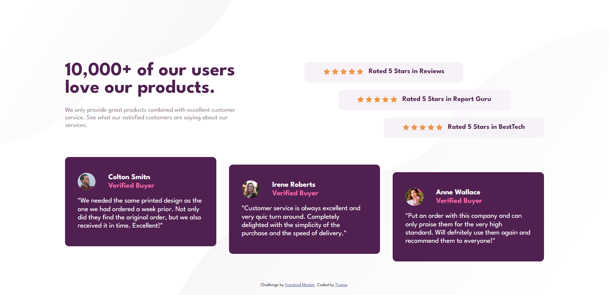
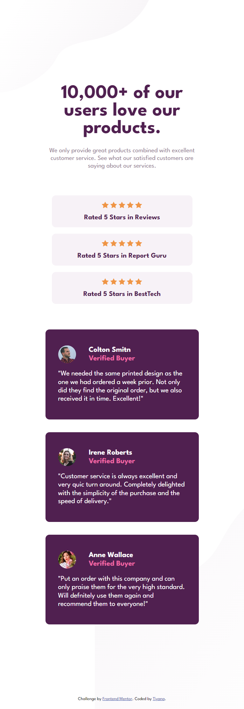

# Frontend Mentor - Social proof section solution

This is a solution to the [Social proof section challenge on Frontend Mentor](https://www.frontendmentor.io/challenges/social-proof-section-6e0qTv_bA). Frontend Mentor challenges help you improve your coding skills by building realistic projects.

## Table of contents

- [Overview](#overview)
  - [The challenge](#the-challenge)
  - [Screenshot](#screenshot)
  - [Links](#links)
- [My process](#my-process)
  - [Built with](#built-with)
  - [What I learned](#what-i-learned)
  - [Continued development](#continued-development)
- [Author](#author)

## Overview

### The challenge

Users should be able to:

- View the optimal layout for the section depending on their device's screen size

### Screenshot



Mobile Size


### Links

- Solution URL: [Solution URL here](https://github.com/Tiyana19/social-proof-section)
- Live Site URL: [Live site URL here](https://tiyana19.github.io/social-proof-section/)

## My process

### Built with

- Semantic HTML5 markup
- CSS custom properties
- Flexbox
- CSS Grid
- Mobile-first workflow

### What I learned

This project was quite a challenge for me.
I used both Grid and Flex property in this and because the mobile screen and desktop screen both had different type of layout so it was bit hard to set everything on its place.

And also the Ladder effect on cards was something that I tried first time.

```
.rating {
    grid-column: 3/4;
    grid-row: 1/2;
    position: relative;
    display: flex;
    flex-direction: column;
    justify-content: center;
    align-items: center;

}
.rating-1 {
    top: 0;
    left: 0;
}
.rating-3 {
    bottom: 0;
    right: 0;
}
```

### Continued development

I will continue to practice with grid and flex to understand them properly.

## Author

- Frontend Mentor - [@Tiyana19](https://www.frontendmentor.io/profile/Tiyana19)
